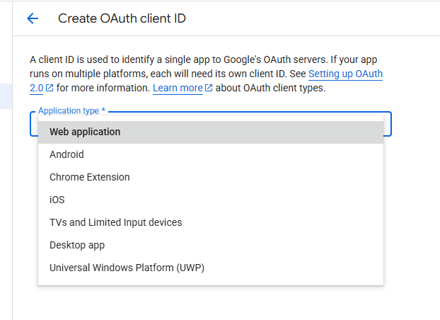
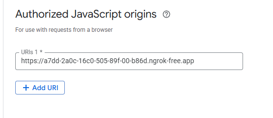
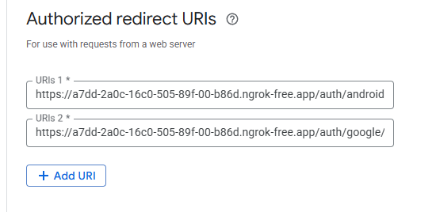
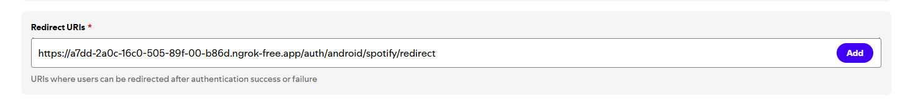
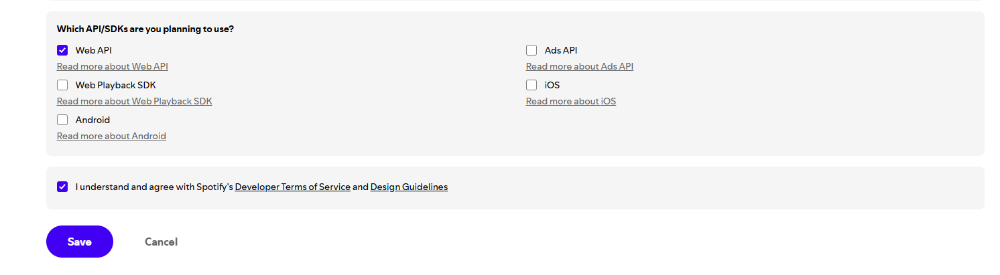

# NestJS backend for Melody Match project

- [NestJS backend for Melody Match project](#nestjs-backend-for-melody-match-project)
  - [Requirements:](#requirements)
  - [Installation](#installation)
    - [Initial setup](#initial-setup)
    - [Setting up the Google OAuth](#setting-up-the-google-oauth)
    - [Setting up the Spotify OAuth](#setting-up-the-spotify-oauth)
  - [Running the app](#running-the-app)
    - [Seeding the database with genres](#seeding-the-database-with-genres)


## Requirements: 
- [Docker](https://www.docker.com) with Docker Compose support
- [Python](https://www.python.org) 3.13+
- [Ngrok](https://ngrok.com) for local development

## Installation
### Initial setup

1. Copy repository to your local machine.
2. Create `.env` file in the root of the project.
3. Copy contents of `.env.example` to `.env`.

> For local development, you need laucnh Ngrok tunnel to your local machine:
>```
>ngrok http localhost:3000
>```
> Save the tunnel url, you will need it later.

### Setting up the Google OAuth
1. In the [Google Cloud Console](https://console.cloud.google.com/), create a new project.
2. Go to the [Auth clients page](https://console.cloud.google.com/auth/clients) and create a new client:

    2.1. Select "Web application" as the application type.

    

    2.2. In the "Authorized JavaScript origins" field enter the url of your web server or ngrok tunnel, for example: 

    `https://a7dd-2a0c-16c0-505-89f-00-b86d.ngrok-free.app/`

    

    2.3. In the "Authorized redirect URIs" field enter the next urls:

    `<your-url>/auth/android/google/redirect`.
    `<your-url>/auth/google/redirect`.
    
    
    
    2.4. Hit "Create".

3. Copy the client ID and secret to the `.env` file, also copy the redirect urls to the `.env` file.

### Setting up the Spotify OAuth
1. In the [Spotify Developer Dashboard](https://developer.spotify.com/dashboard/), create a new app.

2. Paste redirect urls to the "Redirect URIs" field:
`<your-url>/auth/android/spotify/redirect`
`<your-url>/auth/spotify/redirect`


3. Select "Web API" and hit "Save".


4. Copy the client ID and secret to the `.env` file, also copy the redirect urls to the `.env` file.


## Running the app
1. Go to the `nest-melody-match` folder:
```
cd nest-melody-match
```

2. Run docker compose: 
```
docker compose up
```
> Docker will download all the required images, build the app, apply schema to database and run the app.

### Seeding the database with genres
1. Go to the `genres-w2v` folder:

```
cd genres-w2v
```

2. Create virtual environment:
> [Python docs for more info](https://docs.python.org/3/library/venv.html)

3. Install dependencies:

```
pip install -r requirements.txt
```

4. Populate the database:

```
python populate_db.py
```